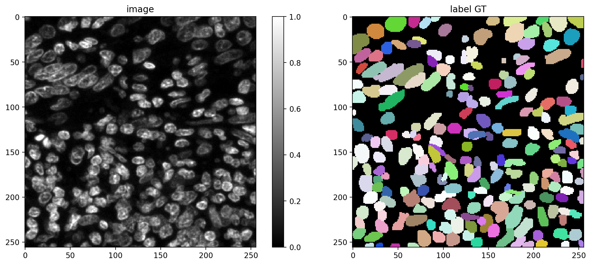
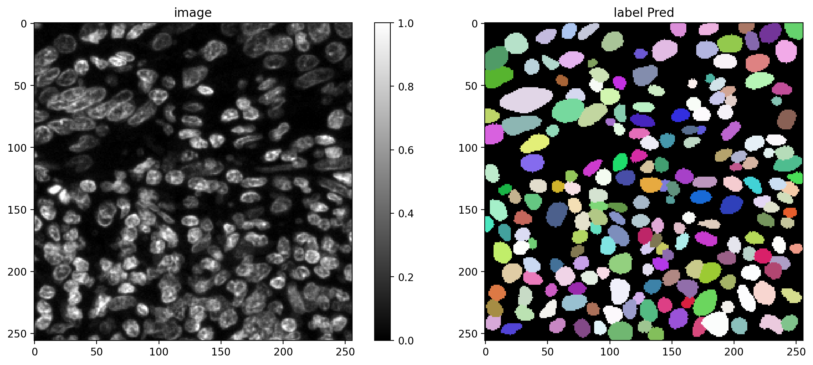

# Cell Segmentation in QMIF Data by Fine-tuning a Stardist2D Model

get the original stardist package here: [StarDist GitHub Repository](https://github.com/stardist/stardist)

## Labeling for training image
Used Fiji LABKIT plugin to annotate manually 50 images for cell boundary segmentation.

## Prediction after training 
Prediction after 32 rays model 

